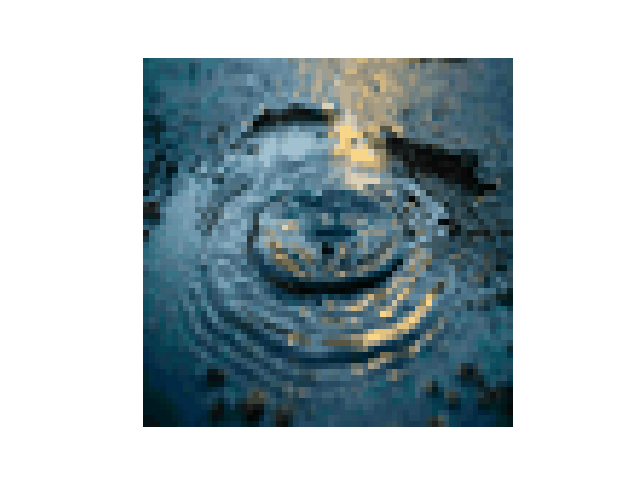

# Morph one image into another using Wasserstein distance

The idea is to create an animation from the interpolation path generated by Optimal Transport path on each RGB channel. I use ott-jax for Skinhole solver.

## Requirements
```text
jax 
jaxlib 
ott-jax
matplotlib 
scikit-image
```

